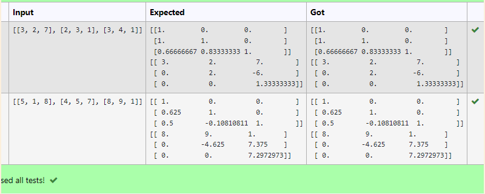
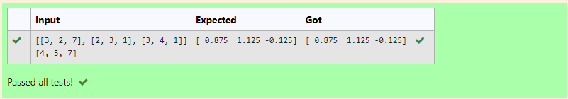

# LU Decomposition 

## AIM:
To write a program to find the LU Decomposition of a matrix.

## Equipments Required:
1. Hardware – PCs
2. Anaconda – Python 3.7 Installation / Moodle-Code Runner

## Algorithm
1. import numpy 
2. import lu from scipy package
3. use syntax p,l,u=lu(a)
4. print the output

## Program:
(i) To find the L and U matrix
```
/*
Program to find the L and U matrix.
Developed by: Easwar
RegisterNumber: 21002130

import numpy as np
from scipy.linalg import lu
a=np.array(eval(input()))
p,l,u=lu(a)
print(l)
print(u)
*/
```


## Output:



## Result:
Thus the program to find the LU Decomposition of a matrix is written and verified using python programming.

## EXPERIMENT 2
## AIM:
To write a program to find the LU Decomposition and solve the matrix.

## Equipments Required:
1. Hardware – PCs
2. Anaconda – Python 3.7 Installation / Moodle-Code Runner

## Algorithm
1. import numpy 
2. import lu_factor,lu_solve from scipy package
3. use syntax p,l,u=lu(a)
4. print the output

## Program:
(i) To find the L and U matrix
```
/*
Program to find the L and U matrix.
Developed by: Easwar
RegisterNumber: 21002130

import numpy as np
from scipy.linalg import lu_factor,lu_solve
a=np.array(eval(input ()))
b=np.array(eval(input()))
lu, pivot=lu_factor(a)
x=lu_solve((lu, pivot),b)
print(x)
*/
```
(ii) To find the LU Decomposition of a matrix
```


## Output:



## Result:
Thus the program to find the LU Decomposition of a matrix is written and verified using python programming.
